<div align="center">


<br/>


&nbsp;

&nbsp;

&nbsp;

&nbsp;


</div>

---

## 📌 What Is This?

**Contract Royalty Extraction & Excel Automation** is an n8n automation that reads **book contract PDFs from Dropbox**, uses **GPT-3.5-Turbo** to extract royalty data for all four publishing formats (Hardcover · Paperback · eBook · Audiobook), and writes the structured results into a **Google Sheets database** — automatically skipping any contracts already processed.

> Built for a publishing house managing foreign rights contracts across multiple territories and languages.

### What it solves

| Before | After |
|:---|:---|
| Manually reading 40+ contract PDFs | Single click — all contracts processed |
| Copy-pasting royalty rates into Excel | AI extracts and formats all data automatically |
| Missing escalator clauses | GPT splits each tier into its own row |
| Re-processing the same contracts | SQL JOIN deduplication — never runs twice on the same file |
| Rates mixed with net receipts / retail basis | Separated into distinct fields every time |

---

## 🤖 Workflow Name

> **`Contract Royalty Extraction & Excel Automation`**

*Reads book contract PDFs → extracts royalty data with AI → writes structured results into Google Sheets.*

---

## ⚡ Architecture Overview

```mermaid
flowchart TD
    A(["🖱️ Manual Trigger"]) --> B & C

    B["📁 Dropbox\nList /Book contracts/\nAll PDFs"] --> D
    C["📊 Google Sheets\nGet already-processed\ncontract IDs"] --> D

    D{"🔀 SQL Merge\nLEFT JOIN — keep only\nNEW / unprocessed files"} --> E

    E["🔢 Select 1st 10\nBatch limit per run"] --> F

    F["⬇️ Dropbox\nDownload PDF binary"] --> G

    G["📄 Extract from PDF\nConvert binary → raw text"] --> H

    H["🔧 Clean Data\nStrip whitespace · tag filename"] --> I

    I(["🔁 Loop Over Items\nProcess one-by-one"]) --> |next item| J

    J["⏳ Wait\nRate-limit buffer"] --> K

    K["🧠 GPT-3.5-Turbo\nExtract royalties\nfor all 4 formats"] --> L

    L["🔧 Clean Royalties\nParse JSON · attach file ID"] --> L

    L --> M & N & O & P

    M["📊 Sheets Tab\nHardcover"]
    N["📊 Sheets Tab\nAudiobook"]
    O["📊 Sheets Tab\nPaperback"]
    P["📊 Sheets Tab\neBook"]

    I --> |done| Q(["✅ Complete"])

    style A fill:#302b63,color:#fff,stroke:#7c3aed
    style B fill:#0061FF,color:#fff,stroke:#004ecc
    style C fill:#34A853,color:#fff,stroke:#2d8f47
    style D fill:#EA4B71,color:#fff,stroke:#c73a5d
    style E fill:#6D00CC,color:#fff,stroke:#5800aa
    style F fill:#0061FF,color:#fff,stroke:#004ecc
    style G fill:#1a0533,color:#fff,stroke:#7c3aed
    style H fill:#1a1a2e,color:#fff,stroke:#a78bfa
    style I fill:#302b63,color:#fff,stroke:#7c3aed
    style J fill:#555,color:#fff,stroke:#333
    style K fill:#412991,color:#fff,stroke:#3a2480
    style L fill:#1a1a2e,color:#fff,stroke:#a78bfa
    style M fill:#34A853,color:#fff,stroke:#2d8f47
    style N fill:#34A853,color:#fff,stroke:#2d8f47
    style O fill:#34A853,color:#fff,stroke:#2d8f47
    style P fill:#34A853,color:#fff,stroke:#2d8f47
    style Q fill:#22c55e,color:#fff,stroke:#16a34a
```

<div align="center">



</div>

## 🖼️ Workflow Screenshots

<div align="center">


</div>

---

## 🔗 Node-by-Node Breakdown


### 1 · Manual Trigger

On-demand execution only. Fires the pipeline manually from the n8n dashboard. Branches into two parallel paths at start for deduplication.

---

### 2 · Deduplication — The Smart Gate

Two nodes run in parallel before any file is downloaded:

```mermaid
flowchart LR
    A(["Trigger"]) --> B["📁 Dropbox\nList ALL PDFs\nin /Book contracts/"]
    A --> C["📊 Sheets\nRead hardcover tab\n(already processed IDs)"]
    B --> D{"SQL Merge\nWHERE sheets.ID IS NULL"}
    C --> D
    D --> E["Only NEW files pass ✅"]
```



**SQL used:**
```sql
SELECT input1.*
FROM input1
LEFT JOIN input2
ON input1.id = input2.ID
WHERE input2.ID IS NULL
```

> `input1` = Dropbox file list · `input2` = already-processed sheet rows  
> Only files whose Dropbox ID is **not found** in the sheet proceed.

---

### 3 · Select 1st 10

Limits each run to **10 contracts maximum**, preventing API quota exhaustion and keeping execution times predictable.

```js
const subsetOfItems = items.slice(0, 10);
```

---

### 4 · Download PDF from Dropbox

```
Node      : Download a file
Source    : Dropbox (OAuth2)
Input     : Dropbox file ID from the listing
Output    : Binary PDF data
```

---

### 5 · Extract Text from PDF

```
Node      : Extract from PDF
Operation : pdf  (n8n built-in)
Output    : Raw extracted text string
```

Converts the binary PDF into a readable text block that can be sent to OpenAI.

---

### 6 · Clean Data (JavaScript)

```js
// Normalises whitespace and tags the source filename
const cleanText = rawText.replace(/\s+/g, ' ').trim();
const fileName  = item.json.fileName || item.json.name || 'unknown.pdf';
```

Key outputs passed downstream:
- `cleanText` — normalised contract text for the AI
- `fileName` — used as a tracking key in every output row

---

### 7 · Loop Over Items

Processes contracts **one at a time** using n8n's `splitInBatches` node — ensuring no two API calls overlap and the wait node can gate each item individually.

---

### 8 · Wait

A rate-limit buffer between batch items. Prevents OpenAI API throttling when processing many contracts in sequence.

---

### 9 · GPT-3.5-Turbo — Royalty Parser

The core intelligence of the pipeline.

**Model:** `gpt-3.5-turbo`  
**Input:** Full cleaned contract text + filename  
**Output:** Structured JSON with royalty data for all 4 formats

#### What it extracts — Contract Metadata

| Field | Example |
|:---|:---|
| Contract Number | `R-143484`, `SRK #95972` |
| Book Title | `The Bodyguard` |
| Author | `J. Armentrout` |
| Publisher (Licensee) | `Akademius` |
| Rights Holder | Original publisher |
| Territory | `World`, `Sweden` |
| Language | `Swedish`, `Danish` |
| Contract Date | `2024-02-06` |
| Currency | `USD`, `EUR`, `SEK` |
| Advance Amount | `$3,000` |
| Term / Duration | `7 years` |

#### What it extracts — Royalties (per format)

| Field | Description |
|:---|:---|
| `Format` | Hardcover / Paperback / Ebook / Audiobook |
| `Sales_Range` | e.g. `1-4000`, `4001-8000`, `>8000`, `All sales` |
| `Royalty_Percentage` | e.g. `8%`, `25%` (number only) |
| `Royalty_Basis` | `Retail price` or `Net receipts` |
| `Escalator_Yes_No` | `Yes` / `No` |
| `Escalator_Details` | Full escalator description |
| `Notes` | Special conditions, mass market vs trade, etc. |
| `Source_Page` | Clause / section reference |
| `Needs_Review` | `Yes` if ambiguous or missing |
| `Processed_Date` | Today's date (auto-set) |

#### Escalator Handling Example

If a contract states: *"6% for first 4,000 copies, 8% for next 4,000, 10% thereafter"*

```
┌─────────────┬─────────────────────┬────────────────────┬────────────────┐
│ Sales_Range │ Royalty_Percentage │ Escalator_Yes_No   │ Escalator_Details │
├─────────────┼─────────────────────┼────────────────────┼────────────────┤
│   1–4000    │        6%           │       Yes          │ 6% (1-4k),     │
│  4001–8000  │        8%           │       Yes          │ 8% (4001-8k),  │
│    >8000    │       10%           │       Yes          │ 10% (>8k)      │
└─────────────┴─────────────────────┴────────────────────┴────────────────┘
```

Each tier becomes its **own row** in the sheet.

---

### 10 · Clean Royalties (JavaScript)

Parses the raw OpenAI JSON string response into a proper JavaScript object and attaches the current file's Dropbox ID for traceability:

```js
const outputText  = openAIResponse.output[0].content[0].text;
const parsedData  = JSON.parse(outputText);
// Attach file ID from Dropbox for deduplication on next run
fileId = $('Download a file').item.json.id;

return { json: { extractedData: parsedData, processingStatus: "success", fileId } };
```

---

### 11 · Four Parallel Sheet Writes

After parsing, all four royalty arrays are written to separate tabs **simultaneously**:

```
clean royalities
    ├──▶ 📊 Hardcover  tab  (gid=0)
    ├──▶ 📊 Audiobook  tab  (gid=1176049859)
    ├──▶ 📊 Paperback  tab  (gid=109834210)
    └──▶ 📊 eBook      tab  (gid=634562927)
```

Each row appended includes the **Dropbox file ID** (`ID` column) — this is what the deduplication SQL JOIN uses on the next run to skip already-processed contracts.

---

## 📊 Google Sheets Schema

All four tabs share the same column structure:

```
ID | Source_File_Name | Contract_Number | Contract_Name | Author_Name |
Publisher_Licensee | Proprietor | Territory | Language | Contract_Date |
Currency | Format | Sales_Range | Royalty_Percentage | Royalty_Basis |
Escalator_Yes_No | Escalator_Details | Notes | Source_Page |
Needs_Review | Processed_Date
```

---

## 📦 Real Contracts Processed

From the pinned test data, this workflow handles real-world contracts including:

| Book | Publisher / Agent |
|:---|:---|
| The 48 Laws of Power | Joost Elffers Books |
| Atomic Habits | Penguin |
| The Body Keeps the Score | Penguin Random House |
| 101 Essays (Brianna Wiest) | TEC |
| Never Split the Difference | DocuSign contract |
| The Daily Stoic | Holiday / Penguin |
| Before the Coffee Gets Cold | Foreign rights |
| Hidden Potential | Swedish rights |
| Stormlight Archive #1–2 | Sanderson |
| Blood and Ash series | Armentrout |
| … and 30+ more | — |

---

## 🔄 Run Sequence (Data Flow)

```mermaid
sequenceDiagram
    participant U as 🖱️ User
    participant D as 📁 Dropbox
    participant S1 as 📊 Sheets (Read)
    participant M as 🔀 Merge
    participant AI as 🧠 GPT-3.5
    participant S2 as 📊 Sheets (Write ×4)

    U->>D: Trigger — list contracts folder
    U->>S1: Trigger — get processed IDs
    D-->>M: All PDF file entries
    S1-->>M: Already-processed IDs
    M->>M: SQL JOIN — drop duplicates
    M->>D: Download new PDFs (max 10)
    D-->>AI: Extracted & cleaned text
    AI-->>S2: Structured royalty JSON
    S2-->>S1: New rows added (ID column)
    Note over M,S1: Next run skips these files ✅
```



---

## 🛠️ Tech Stack

<div align="center">

| Tool | Role |
|:---|:---|
|  | Workflow orchestration |
|  | Contract PDF storage |
|  | AI royalty extraction |
|  | Structured output (4 tabs) |
|  | Data cleaning & JSON parsing |

</div>

---

## 🚀 Setup Guide

### Prerequisites

- [ ] n8n instance (self-hosted or cloud)
- [ ] Dropbox OAuth2 credentials in n8n
- [ ] Google Sheets OAuth2 credentials in n8n (two accounts used)
- [ ] OpenAI API key configured in n8n
- [ ] Google Sheet with 4 tabs: `hardcover`, `paperback`, `audiobook`, `eBook`
- [ ] Dropbox folder: `/Book contracts/` containing PDF contracts

### Activation Steps

1. Import the workflow JSON into n8n
2. Connect **Dropbox OAuth2** credentials to the two Dropbox nodes
3. Connect **Google Sheets OAuth2** credentials (primary account for output)
4. Connect primary account (output sheets — `hardcover`, `paperback`, `audiobook`, `eBook` nodes)
5. Connect secondary account (read sheet — `Get row(s) in sheet` node)
6. Update all Google Sheets URLs to your own spreadsheet
7. Run manually — the workflow is **on-demand only** (not scheduled)

> **Note:** The workflow is set to `active: false` — it runs only when manually triggered from the n8n dashboard.

---

## ⚙️ Key Design Decisions

| Decision | Reason |
|:---|:---|
| Batch limit of 10 | Prevents OpenAI token quota exhaustion per run |
| Wait node in loop | Rate-limits sequential API calls |
| SQL JOIN for dedup | Robust — works even if sheet rows are reordered |
| 4 separate sheet tabs | Easier filtering/analysis per format in Sheets |
| `fileName` in every row | Full traceability back to source PDF |
| `Needs_Review` flag | Surfaces ambiguous clauses for human QA |
| Escalators → separate rows | Enables proper royalty calculations per sales tier |

---

<div align="center">

**Built by [Abdul Rehman](https://github.com/ar-rehman786)**

[](mailto:abdulrehmanhameed4321@gmail.com)
&nbsp;
[](https://www.sloraai.com/)
&nbsp;
[](https://github.com/ar-rehman786)

</div>


