<div align="center">


<br/>


&nbsp;

&nbsp;

&nbsp;

&nbsp;


</div>

---

## 📌 What Is This?

**After-Hours Emergency Escalation** is a three-scenario Make.com automation for **First Service**, a home services company. When a customer calls after-hours, a **Retell AI voice agent** handles the intake and classifies the request. This system then takes over automatically — escalating true emergencies to a live on-call technician via **AI outbound calls + SMS**, while routing non-urgent requests to the next business day via **email**.

If the on-call technician doesn't pick up, the system **retries up to 4 times**, waiting 30 seconds between each attempt, before giving up.

> No after-hours emergency goes unanswered. No human has to monitor a phone at night.

---

## 🧭 System Overview — 3 Scenarios

| Scenario | Trigger | Role |
|:---|:---|:---|
| **Flow A** — Intake & Route | Retell AI intake call ends | Classify emergency vs. callback, fire first alert |
| **Flow B** — Retry Engine | Retell AI outbound call ends | Check if answered; retry up to 4× if not |
| **Flow C** — Resolution | Outbound call answered / max retries reached | Mark resolved or escalate to fallback |

---

## ⚡ Full System Architecture

```mermaid
flowchart TD
    CALLER(["📞 Customer calls\nafter-hours"]) --> RAI

    RAI["🤖 Retell AI\nVoice Intake Agent\nCollects: name, phone, address,\nissue, category, choice"] --> WH_A

    WH_A["⚡ Webhook → Flow A\nCall ends → payload sent\nto Make.com instantly"] --> DS_ADD

    DS_ADD["💾 Data Store\nSave call record\nKeyed by call_id"] --> FILTER_A

    FILTER_A{"📞 Caller phone\nexists?"} -- "✅ Yes" --> ROUTER_A
    FILTER_A -- "❌ No" --> STOP_A(["🚫 Stop"])

    ROUTER_A{"🔀 Router\ncustomer_choice?"} -- "EMERGENCY_NOW" --> EMERG_PATH
    ROUTER_A -- "NEXT_AVAILABLE" --> CB_PATH

    subgraph EMERG_PATH ["🚨 Emergency Path"]
        RETELL_CALL["🧠 Build Retell JSON\nPrepare outbound call payload"] --> HTTP_CALL
        HTTP_CALL["📡 POST → Retell API\nTrigger outbound AI call\nto on-call tech: +1 701-491-9488"] --> UPDATE_1
        UPDATE_1["💾 Update Record\ncall_attempts = 1"] --> SMS
        SMS["📱 OpenPhone SMS\nAlert on-call technician\nwith caller details"]
    end

    subgraph CB_PATH ["📅 Callback Path"]
        EMAIL["📧 Gmail\nSend callback request email\nwith preferred time window"]
    end

    SMS --> WH_B
    HTTP_CALL --> WH_B

    WH_B["⚡ Webhook → Flow B\nOutbound call ends\n→ Make.com fires"] --> DS_GET

    DS_GET["💾 Data Store\nGet record by incident_key"] --> ROUTER_B

    ROUTER_B{"🔀 Check conditions:\nNot answered?\nretry_pending = true?\ncall_attempts < 4?"} -- "All true → CONTINUE" --> WAIT

    subgraph RETRY_LOOP ["🔁 Retry Loop (max 4x)"]
        WAIT["⏳ Wait 30 seconds"] --> INC
        INC["🔢 Increment\ncall_attempts + 1"] --> UPDATE_2
        UPDATE_2["💾 Update Record\nnew attempt count"] --> RETELL_2
        RETELL_2["🧠 Build Retell JSON"] --> HTTP_2
        HTTP_2["📡 POST → Retell API\nNew outbound call attempt"]
    end

    ROUTER_B -- "Answered or max retries" --> RESOLVED(["✅ Resolved /\n⛔ Max Retries"])

    style CALLER fill:#302b63,color:#fff,stroke:#7c3aed
    style RAI fill:#7c3aed,color:#fff,stroke:#5b21b6
    style WH_A fill:#EA4B71,color:#fff,stroke:#c73a5d
    style DS_ADD fill:#1a1a2e,color:#fff,stroke:#7c3aed
    style FILTER_A fill:#EA4B71,color:#fff,stroke:#c73a5d
    style ROUTER_A fill:#6D00CC,color:#fff,stroke:#5800aa
    style RETELL_CALL fill:#412991,color:#fff,stroke:#3a2480
    style HTTP_CALL fill:#1a0533,color:#fff,stroke:#7c3aed
    style UPDATE_1 fill:#1a1a2e,color:#fff,stroke:#7c3aed
    style SMS fill:#16a34a,color:#fff,stroke:#15803d
    style EMAIL fill:#D14836,color:#fff,stroke:#b03a2d
    style WH_B fill:#EA4B71,color:#fff,stroke:#c73a5d
    style DS_GET fill:#1a1a2e,color:#fff,stroke:#7c3aed
    style ROUTER_B fill:#6D00CC,color:#fff,stroke:#5800aa
    style WAIT fill:#555,color:#fff,stroke:#333
    style INC fill:#302b63,color:#fff,stroke:#7c3aed
    style UPDATE_2 fill:#1a1a2e,color:#fff,stroke:#7c3aed
    style RETELL_2 fill:#412991,color:#fff,stroke:#3a2480
    style HTTP_2 fill:#1a0533,color:#fff,stroke:#7c3aed
    style STOP_A fill:#444,color:#fff,stroke:#333
    style RESOLVED fill:#22c55e,color:#fff,stroke:#16a34a
```

<div align="center">



</div>

---

## 🔗 Scenario-by-Scenario Breakdown

### 🅰️ Flow A — Intake & Route

**Trigger:** Retell AI fires this webhook the moment an after-hours intake call ends.

#### Node Flow

```
Webhook (HOLD)
    ↓
[FILTER] custom_analysis_data exists?
    ↓ ✅
Data Store — Add Record  (First_Service_Emergency_Escalation)
    key = call_id
    stores full call payload including custom_analysis_data
    ↓
[FILTER] caller_phone exists?
    ↓ ✅
Router — Split on customer_choice
    ├── EMERGENCY_NOW ────────────────────────────────────────────→ Emergency Path
    └── NEXT_AVAILABLE ───────────────────────────────────────────→ Callback Path
```

#### Emergency Path

```
1. Create JSON  →  Retell outbound call payload
                   to_number : +17014919488 (on-call tech)
                   from_number : +19517449680
                   agent_id : agent_fd36b...
                   Dynamic vars: caller_name, caller_phone, address,
                                 issue_summary, issue_category, notes,
                                 intake_call_id

2. HTTP POST  →  https://api.retellai.com/v2/create-phone-call
   Bearer: key_97100c584b06c7e87343409059ab
   [FILTER: customer_choice contains "EMERGENCY_NOW"]

3. Data Store Update  →  set call_attempts = "1"

4. OpenPhone SMS  →  to: +17014919488
   from: (707) 336-8748
   Content:
   ┌─────────────────────────────────────────────────────────┐
   │ First Service - Emergency On-Call Request               │
   │ Name: {caller_name}                                     │
   │ Phone: {caller_phone}                                   │
   │ Address: {caller_address}                               │
   │ Issue: {issue_summary}                                  │
   │                                                         │
   │ Follow up immediately. If unable, notify supervisor     │
   │ and inform the customer.                                │
   └─────────────────────────────────────────────────────────┘
```

#### Callback Path (NEXT_AVAILABLE)

```
Email  →  mikehawkinz@gmail.com
Subject: Job Request {caller_address}
Body: callback request with preferred_callback_window,
      caller_name, phone, issue_summary, notes
```

---

### 🅱️ Flow B — Retry Engine

**Trigger:** Retell AI fires this webhook when each outbound call to the on-call technician ends.

#### Node Flow

```
Webhook (First Service Emergency Escalation B)
    ↓
Data Store — Get Record
    key = incident_key  (passed by Retell on outbound call end)
    returns full stored call record
    ↓
Router
    ├── CONTINUE path  (all 3 filters must pass)
    └── STOP path
```

#### CONTINUE Filter — All 3 Must Pass (OR logic between rows)

```
┌─────┬──────────────────────────────────────────────────────────────┐
│  1  │  status  ≠  "Answered"   →  tech didn't pick up             │
│  2  │  retry_pending  =  "true"  →  retry was flagged             │
│  3  │  call_attempts  <  4       →  haven't tried 4 times yet     │
└─────┴──────────────────────────────────────────────────────────────┘
```

#### Retry Sequence

```
1. ⏳ Wait 30 seconds

2. Set Variable: new_attempts
   = parseNumber(call_attempts) + 1

3. Data Store Update
   call_attempts = new_attempts

4. Create JSON → Retell outbound call payload
   (same structure as Flow A, using stored call data)

5. HTTP POST → Retell API
   triggers another outbound call to on-call tech
   (Flow B fires again when this call ends → loop)
```

#### Retry Timeline

```
Attempt 1  →  Flow A fires → call placed → tech doesn't answer
               ↓ (30s wait)
Attempt 2  →  Flow B fires → retry → call placed → still no answer
               ↓ (30s wait)
Attempt 3  →  Flow B fires → retry → call placed → still no answer
               ↓ (30s wait)
Attempt 4  →  Flow B fires → retry → call placed
               ↓
call_attempts = 4 → CONTINUE filter fails → STOP path handles it
```

---

### 🅲️ Flow C — Resolution / Final State

Handles the terminal outcomes when a retry loop completes:

| Condition | Action |
|:---|:---|
| Tech answers (`status = "Answered"`) | Mark record resolved, stop retries |
| `call_attempts ≥ 4` | Final escalation or fallback notification |
| `retry_pending = false` | No further action needed |

---

## 📊 Data Flowing Through the System

### Call Payload (from Retell AI)

| Field | Description |
|:---|:---|
| `call_id` | Unique call identifier (used as datastore key) |
| `agent_id` | Retell intake agent ID |
| `direction` / `from_number` / `to_number` | Call metadata |
| `call_summary` | AI-generated transcript summary |
| `caller_name` | Extracted from conversation |
| `caller_phone` | Callback number |
| `caller_address` | Service location |
| `issue_summary` | What's wrong |
| `issue_category` | Type of issue (plumbing, HVAC, etc.) |
| `preferred_callback_window` | When they want a callback |
| `notes` | Any extra details |
| `customer_choice` | `EMERGENCY_NOW` or `NEXT_AVAILABLE` |

### Datastore Record (Make.com Data Store: `First_Service_Emergency_Escalation`)

| Field | Managed by | Purpose |
|:---|:---|:---|
| `key` (= call_id) | Flow A | Unique identifier |
| `call_attempts` | Flow A + B | Tracks # retry attempts |
| `retry_pending` | Flow A | Signals Flow B to keep retrying |
| `status` | Flow B/C | `"Answered"` when resolved |
| `last_call_id_outgoing` | Flow B | Tracks outbound call IDs |
| All intake fields | Flow A | Passed to outbound calls |

---

## 🔄 End-to-End Sequence


---

## 🛠️ Tech Stack

<div align="center">

| Tool | Role |
|:---|:---|
|  | Workflow orchestration (3 scenarios) |
|  | AI voice intake + AI outbound escalation calls |
|  | State persistence across scenarios |
|  | SMS alert to on-call technician |
|  | Non-emergency callback email |

</div>

---

## 🚀 Setup Guide

### Prerequisites

- [ ] Make.com account with 3 scenarios imported
- [ ] Retell AI account with intake agent configured
- [ ] Make Data Store created: `First_Service_Emergency_Escalation`
- [ ] OpenPhone account connected in Make
- [ ] Google/Gmail account connected in Make
- [ ] Retell AI webhooks pointed to Flow A and Flow B webhook URLs

### Webhook Configuration in Retell AI

| Webhook | Points to | When fired |
|:---|:---|:---|
| Post-call webhook (intake agent) | Flow A webhook URL | Intake call ends |
| Post-call webhook (outbound agent) | Flow B webhook URL | Outbound call ends |

### Phone Numbers

| Number | Role |
|:---|:---|
| `+19517449680` | Retell outbound caller ID (from) |
| `+17014919488` | On-call technician (to) |
| `(707) 336-8748` | OpenPhone SMS sender |

### Activation Steps

1. Create the Make Data Store with schema matching the call payload fields
2. Import **Flow A** → connect Retell AI webhook → connect Data Store → connect OpenPhone + Gmail
3. Import **Flow B** → connect Retell AI webhook → connect Data Store
4. Import **Flow C** → connect as needed for resolution logic
5. Point Retell intake agent post-call webhook → Flow A URL
6. Point Retell outbound agent post-call webhook → Flow B URL
7. Toggle all 3 scenarios to **Active** ✅

---

## ⚙️ Key Design Decisions

| Decision | Reason |
|:---|:---|
| Data Store as shared state | Passes call data between 3 independent scenarios without re-calling Retell API |
| 30-second wait between retries | Gives technician time to see missed call before next attempt |
| Max 4 attempts | Prevents infinite retry loops while giving reasonable escalation window |
| SMS + AI call together | Belt-and-suspenders: text ensures tech sees it even if call goes to voicemail |
| `incident_key` passed by Retell outbound | Links outbound call result back to original intake record |
| `retry_pending` flag | Clean enable/disable control on retry loop without deleting records |

---

## 📈 How It Works End-to-End

```
Customer calls after hours
        ↓
Retell AI takes the call (no human needed at night)
        ↓
Customer says "I have an emergency"
        ↓
Flow A: Record stored → AI calls on-call tech + SMS sent
        ↓
Tech doesn't answer → Flow B retries every 30 seconds × 4
        ↓
Tech answers → AI briefs them on the customer's issue
        ↓
Tech calls customer directly to handle the emergency
```

Zero humans monitoring phones at 2AM. Zero missed emergencies.

---

<div align="center">

**Built by [Abdul Rehman](https://github.com/ar-rehman786)**

[](mailto:abdulrehmanhameed4321@gmail.com)
&nbsp;
[](https://www.sloraai.com/)
&nbsp;
[](https://github.com/ar-rehman786)

</div>


